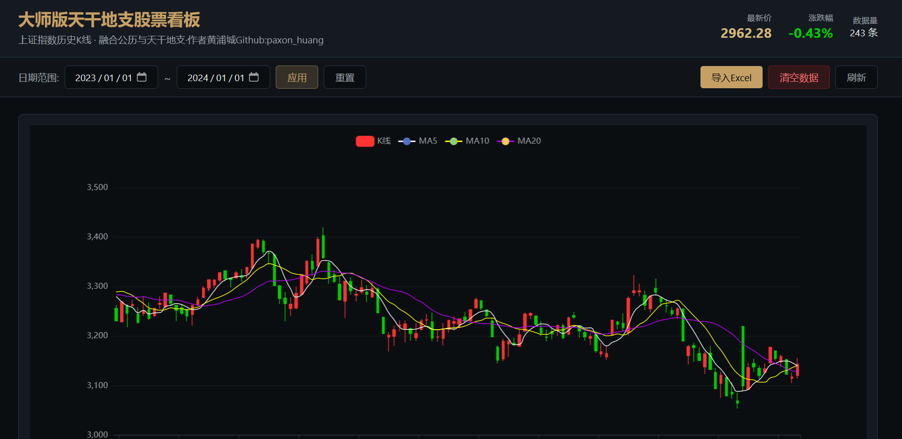
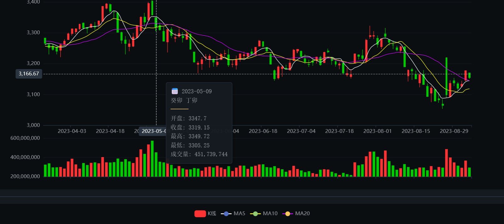

# 干支股票看板 (GanZhi Stock Dashboard)

一个结合中国传统历法(干支)与现代金融图表的中国股票K线可视化应用。

## 项目简介

干支股票看板是一个创新的金融数据可视化平台,将传统中国历法系统(干支)与股票K线图相结合,为投资者提供独特的市场分析视角。




### 核心特性

- 📊 **K线图表**: 使用ECharts实现专业的金融图表展示
- 🗓️ **干支历法**: 集成中国传统历法系统,显示年干支和日干支
- 📈 **月K线图**: 干支月K线图,以干支作为x轴显示月度行情
- 🔮 **五行分析**: 基于天干地支的五行属性生成投资建议
- 🖱️ **点击标注**: 点击K线蜡烛图可标注/取消标注感兴趣的位置
- 🎨 **现代UI**: 使用TailwindCSS构建的深色金融主题界面
- 🔒 **安全可靠**: 基于Supabase的数据库和Cloudflare Workers的后端服务

## 技术栈

### 前端

- **框架**: React 18 + TypeScript
- **构建工具**: Vite
- **样式**: TailwindCSS
- **图表**: ECharts + echarts-for-react
- **日期处理**: dayjs
- **历法转换**: lunar-javascript
- **数据导入**: xlsx (SheetJS)
- **数据库客户端**: @supabase/supabase-js
- **测试**: Vitest + Testing Library

### 后端

- **云函数**: Cloudflare Workers (Python)
- **数据库**: Supabase (PostgreSQL)
- **数据验证**: MCP Server (ganzhi-stock-validator-mcp)

## 项目结构

```
TiangandizhiStock/
├── frontend/                    # 前端应用
│   ├── src/
│   │   ├── components/         # React组件
│   │   │   ├── KLineChart.tsx        # 日K线图(支持点击标注)
│   │   │   ├── MonthlyKLineChart.tsx # 干支月K线图
│   │   │   └── FiveElementsAdvice.tsx # 五行投资建议面板
│   │   ├── pages/              # 页面组件
│   │   │   └── Dashboard.tsx   # 主看板页面
│   │   ├── config/            # 配置文件
│   │   ├── types/             # TypeScript类型定义
│   │   └── utils/             # 工具函数
│   │       ├── dateConverter.ts    # 干支日期转换
│   │       └── fiveElements.ts     # 五行计算与建议
│   ├── package.json
│   └── vite.config.ts
├── workers/                    # Cloudflare Workers后端
│   ├── src/
│   │   └── index.py
│   ├── wrangler.toml
│   └── README.md
├── ganzhi-stock-validator-mcp/ # MCP数据验证服务器
│   ├── src/
│   │   └── ganzhi_stock_validator/
│   └── pyproject.toml
├── supabase/                   # 数据库schema
│   └── schema.sql
├── scripts/                    # 脚本工具
│   └── import_data.py
└── README.md
```

## 快速开始

### 前置要求

- Node.js 18+
- Python 3.9+
- Cloudflare账户
- Supabase账户

### 安装与配置

#### 1. 克隆项目

```bash
git clone <repository-url>
cd TiangandizhiStock
```

#### 2. 配置Supabase数据库

1. 在Supabase创建新项目
2. 在SQL编辑器中运行 `supabase/schema.sql`
3. 获取项目URL和API密钥

#### 3. 配置前端

```bash
cd frontend

# 安装依赖
npm install

# 创建环境变量文件
cp .env.example .env

# 编辑.env文件,添加Supabase配置
VITE_SUPABASE_URL=your-supabase-url
VITE_SUPABASE_ANON_KEY=your-anon-key

# 启动开发服务器
npm run dev
```

#### 4. 配置后端Worker

```bash
cd workers

# 安装依赖
pip install -e .

# 创建环境变量文件
cp .dev.vars.example .dev.vars

# 编辑.dev.vars文件
SUPABASE_URL=https://your-project.supabase.co
SUPABASE_SERVICE_KEY=your-service-role-key

# 本地开发
wrangler dev

# 部署到Cloudflare
wrangler deploy
```

#### 5. 配置MCP验证服务器

```bash
cd ganzhi-stock-validator-mcp

# 安装依赖
pip install -e .

# 运行服务器
python -m ganzhi_stock_validator.server
```

## 数据库Schema

### stock_data表

| 字段       | 类型        | 说明               |
| ---------- | ----------- | ------------------ |
| id         | uuid        | 主键               |
| trade_date | date        | 交易日期(唯一)     |
| open       | numeric     | 开盘价             |
| high       | numeric     | 最高价             |
| low        | numeric     | 最低价             |
| close      | numeric     | 收盘价             |
| volume     | numeric     | 成交量             |
| amount     | numeric     | 成交额             |
| ganzi_year | text        | 年干支(如"庚午年") |
| ganzi_day  | text        | 日干支(如"甲子日") |
| created_at | timestamptz | 记录创建时间       |

### 安全策略

- 公开读取权限
- 认证用户可写入
- 启用行级安全(RLS)

## API端点

### 健康检查

```
GET /api/health
```

### 获取股票数据

```
GET /api/stock-data?start_date=YYYY-MM-DD&end_date=YYYY-MM-DD&limit=N
```

## 数据导入

项目提供Excel数据导入功能:

```bash
python scripts/import_data.py --file 上证指数.xlsx
```

## 开发指南

### 代码规范

项目遵循严格的TypeScript规范:

- 启用严格模式
- 禁止使用 `any`类型
- 必须定义所有接口和类型

### 命名约定

| 类型      | 约定             | 示例                 |
| --------- | ---------------- | -------------------- |
| 组件      | PascalCase       | `KLineChart.tsx`   |
| 工具函数  | camelCase        | `dateConverter.ts` |
| 接口/类型 | PascalCase       | `StockData`        |
| 常量      | UPPER_SNAKE_CASE | `API_ENDPOINTS`    |

### 测试

```bash
# 前端测试
cd frontend
npm run test

# 后端测试
cd ganzhi-stock-validator-mcp
pytest
```

## 环境变量

### 前端 (.env)

```
VITE_SUPABASE_URL=your-supabase-url
VITE_SUPABASE_ANON_KEY=your-anon-key
```

### Workers (.dev.vars)

```
SUPABASE_URL=https://your-project.supabase.co
SUPABASE_SERVICE_KEY=your-service-role-key
```

## 部署

### 前端部署

```bash
cd frontend
npm run build
# 将dist目录部署到静态托管服务
```

### 后端部署

```bash
cd workers
wrangler deploy
```

## 故障排除

### 常见问题

1. **Supabase连接失败**
   - 检查环境变量是否正确配置
   - 确认数据库已正确初始化
2. **CORS错误**
   - 检查Worker的CORS配置
   - 确认Supabase项目的CORS设置
3. **数据导入失败**
   - 验证Excel文件格式
   - 使用MCP验证服务器检查数据质量

## 贡献指南

欢迎贡献代码!请遵循以下步骤:

1. Fork项目
2. 创建特性分支 (`git checkout -b feature/AmazingFeature`)
3. 提交更改 (`git commit -m 'Add some AmazingFeature'`)
4. 推送到分支 (`git push origin feature/AmazingFeature`)
5. 开启Pull Request

## 许可证

MIT License

## 联系方式

如有问题或建议,请提交Issue或Pull Request。

## 致谢

- [ECharts](https://echarts.apache.org/) - 强大的图表库
- [Supabase](https://supabase.com/) - 开源Firebase替代方案
- [Cloudflare Workers](https://workers.cloudflare.com/) - 边缘计算平台
- [lunar-javascript](https://6tail.cn/calendar/api.html) - 中国农历库
